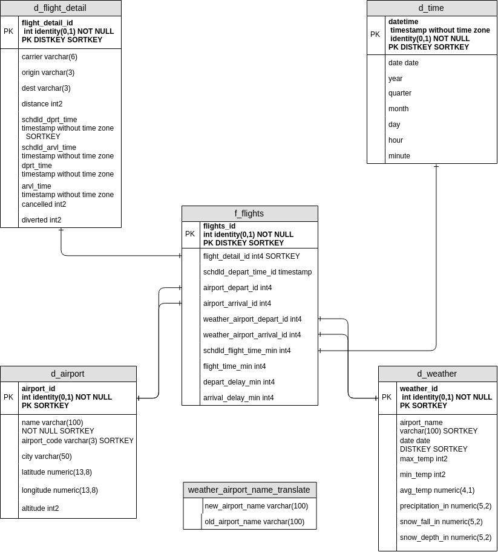

## Project Summary
Weatherfly is a new startup company in stealth mode that is looking to improve airline travel for businesses and families. Flight delays are known to many who travel across the United States and is an area with many promising opportunities. In order to prove out their business model they need to be able to reliably predict when delays are likely to occur. They have asked our company to setup a production analytics environment for them to run their analysis and machine learning models.

## Scope and Goals
The scope is to build an analytics platform on AWS Redshift for the Weatherfly team to run queries against. The goal is to have 20 years worth of flight and weather data to support their analysis. In order to meet these goals, we need to do the following:
1. Find a data source that has 20 years worth of US flight data and corresponding airport data. To determine how weather affects travel we will also need to get the associated weather data for these airports over this same time period.
2. The data will need to be cleaned up and prepared for the data model.
3. In order to ensure we have fast queries, we will use a Fact and Dimmension model.
4. The data will be uploaded to S3 and loaded into stage tables in Redshift. From there we will load into the Fact / Dimmension tables.
5. The ETL pipeline will be built using Airflow to schedule and coordinate the activities.

## Gather Data
After doing some extensive online searches for the data, I arrived at the following sources of data to meet our goals. 

**Flights -** The site stat-computing.org had a great [flight data set](http://stat-computing.org/dataexpo/2009/the-data.html) for the years of 1987 to 2008. These files were bz2 compressed csv files containing US flight data for each year.

**Airports -** Originally, I used the supplemental [airport data](http://stat-computing.org/dataexpo/2009/supplemental-data.html) provided along with the flight data, however I moved away from that later in the project. This is the [airport data set](https://openflights.org/data.html#airport), I ended up using as it had more information and better names from openflights.org. 

**Weather -**
The [Applied Climate Information System](http://www.rcc-acis.org/docs_webservices.html) site had a great API to pull detailed weather data. It had detailed documentation and great set of examples to work off of. 

**Download Data -** All three of these datasets were pulled down locally for analysis using the gather_datasets.py script. This allowed us to use a Jupyter Notebook to explore the data sets and identify some of the data issues we would need to fix. The script can be configured to use sequential or parallel processing to download the data depending on your system (see the configs.cfg for more details).

## Data Exploration
In our exploration of the data we noted several areas that needed to be cleaned up before we could process the data into our model. See the [Jupyter Notebook]() or the [SQL statements]() for more details.

**Key Data Decisions -**
 * Only use US International airports and corresponding flight/weather data - This decision was made due to the fact that we did not have adequate flight/weather data for the smaller airports across the US.
 * All flight, airport, and weather data will be included into the dimmension tables, however only joined data will be included in the fact table
 * The scheduled departure time for a given flight will be the time dimmension used in this model since it is the starting point for all flights.

**Flight Data -**
 * Include only US international airport flights
 * Convert date and time fields to a single datetime field - special handling was needed due to invalid values (i.e. 95 minutes or the time 2525)
 * Text in numerical columns - Replace with null
 
**Airport Data -**
 * Text with whitespaces - Trim fields on upload
 * Filter out non-USA flight data
 * Rename columns to be more meaning full
 * Null fields - removed from final data set
 * Include only US international airports
 * Fix airport names so they can be joined across tables - using the new airport file caused an extra step to match up the names

**Weather Data -**
 * Text in numerical columns - Replaced with 0's
 * Include only weather data for US international airports
  
## Data Model
Now that we have our data sets and areas to clean up we can create our data model. Since analytic queries against large datasets are faster with a Fact / Dimmensional model with limited joins, we will create one here. To do that we need to do the following:
* Primary Key, Distkey, and Sortkey (see diagram)
  * Columns marked as the primary key are the main way to query that data.
  * Distkey - Distributes like data across the nodes.
  * Sortkey - Sorts data on each node for faster access.
* f_flights - This will be our fact table that contains the keys to the other tables and will include some basic summary times from each flight.
* d_flight_detail - This will contain details about each flight
* d_time - Contains the scheduled departure time dimmension. 
* d_airport - This table holds details about the airport.
* d_weather - All weather information is located in this table.
* weather_airport_name_translate - This is a translation table used in the ETL and is not a dimmensional table.

### Data Model Image

### Data Dictionary
| Table | Column | Definition |
|------|---------|-------|
|f_flights | flights_id |unique id for the record|
|f_flights | flight_detail_id |unique id for the d_flight_detail table|
|f_flights | schdld_depart_time_id |unique id for the d_time table| 
|f_flights | airport_depart_id |unique id for the d_airport table for departure|
|f_flights | airport_arrival_id |unique id for the d_airport table for arrival|
|f_flights | weather_airport_depart_id |unique id for the d_weather table for departure| 
|f_flights | weather_airport_arrival_id |unique id for the d_weather table for arrival|
|f_flights | schdld_flight_time_min |scheduled flight time in minutes|
|f_flights | flight_time_min |flight time in minutes|
|f_flights | depart_delay_min |depart delay time in minutes|
|f_flights | arrival_delay_min |arrival delay time in minutes|
|d_flight_detail|flight_detail_id|unique id fo the record|
|d_flight_detail|carrier|airline carrier id|
|d_flight_detail|origin|origin airport code |
|d_flight_detail|dest|destination airport code|
|d_flight_detail|distance|flight path distance|
|d_flight_detail|schdld_dprt_time|scheduled departure time|
|d_flight_detail|schdld_arvl_time|scheduled arrival time|
|d_flight_detail|dprt_time|actual departure time|
|d_flight_detail|arvl_time|actual arrival time|
|d_flight_detail|cancelled|indicates flight was cancelled|
|d_flight_detail|diverted|indicates flight was diverted|
|d_time|datetime|date time of scheduled departure of flight|
|d_time|date| date of departure|
|d_time|year|year of departure|
|d_time|quarter|quarter of departure|
|d_time|month|month of departure|
|d_time|day|day of departure|
|d_time|hour|hour of departure|
|d_time|minute|minute of departure|
|d_weather|airport_name|name of airport where weather measurements wer taken |
|d_weather|date|date measurements taken|
|d_weather|max_temp|maximum temperature|
|d_weather|min_temp|minimum temperature|
|d_weather|avg_temp|average temperature|
|d_weather|precipitation_in|preciptiation in inches|
|d_weather|snow_fall_in|snow fall in inches|
|d_weather|snow_depth_in|snow depth in inches|
|d_airport|airport_id|unique id of record|
|d_airport|name| name of airport|
|d_airport|airport_code| unique 3 digit code|
|d_airport|city|city airport is located|
|d_airport|latitude|latitude of airport location|
|d_airport|longitude|longitude of airport location|
|d_airport|altitude|alitude of airport location|
|weather_airport_name_translate|new_airport_name|new name to use|
|weather_airport_name_translate|old_airport_name|old name to be replaced|

## ETL
With our data cleanup identified and data model defined, we can now build out the ETL process to populate our model. For this step we will be using the following:
* Airflow - This workflow scheduler will be used to schedule and sequence our individual steps in the process.
* S3 - Our data files will be uploaded to an S3 bucket that we can leverage the fast bulk integration between S3 and Redshift to stage our data.
* Redshift - This will be our primary workhorse for executing the cleanup scripts and population of our model. 

### ETL Steps
1. Create staging, dimmension and fact tables. The current setup will drop each of these tables before creating the table. In production you would turn this portion off or takeout the creation step. This step will only create the tables if they do not exist.
2. Once the tables are created we now need to load the data in S3 into Redshift. We use the Redshift copy command to do this. Since there are many files we are able to leverage AWS's built in parallelism to stage the data.
3. Before we load the data into the model, we have inserted a step to update the airport names in the staging table and future joins produce the correct results. This is an example of using tables rather than config files for changing data. We are able to add records to the table or file in S3 and ensure all future records are also translated.
4. From here we load the dimmensional data into the model. Each [sql query](plugins/helpers/sql_queries.py) has the specific logic to transform any data that is necessary as the insert is happening. This allows us to leverage the fast processing of AWS and does not require another server for ETL. After the dimmensional data is loaded we load the fact table.
5. The last step is to run some data quality checks to ensure that the ETL processes completed successfully. The following checks we are running for this setup are:
  * Record counts are > 0 for all tables in the model.
  * Data for each calendar year is present in the f_flights, d_flight_detail, and d_time tables.
6. Finally, this ETL pipeline is not scheduled, but is easily configurable. Simply update the weatherfly_dag.py and set the start_date, end_date, and scheduled_interval to the appropriate values.

## Final Processing Results
### Full Run Results

### Data Quality Checks with Counts

## Future Growth Scenarios
If the data was increased by 100x:
1. The first change would be to increase the amount of Redshift nodes in the cluster.
2. File size matters in this solution. If the files grow in size rather then the number of files, then consideration should be made to split them in order to continue to benefit from the parallelism of S3 and Redshift.
3. Move Airflow to a clustered instance. This will ensure that tasks that can run in parallel continue to do so by having enough resources to process.

If the pipelines were run on a daily basis by 7am:
1. No change is needed as Airflow is currently being used and just needs to be scheduled.
2. Performance considerations are noted above to ensure the data is completed by 7am.

If the database needed to be accessed by 100+ people:
1. Concurrent usage needs is dependant on the Redshift cluster size, the type of queries they are running, and the expected execution time of the queries. Scaling the number of Redshift nodes should be considered.
2. Depending on the type of queries being run, additional data models may need to be built if the joins and where conditions are considerably different. Optimizing the models for the compute intensive, longest running, and most common queries would improve performance.

## How to Run
1. Setup an [AWS account](https://aws.amazon.com/premiumsupport/knowledge-center/create-and-activate-aws-account/) and [create a user](https://docs.aws.amazon.com/IAM/latest/UserGuide/getting-started_create-admin-group.html) that has the following AWS permissions.

    

2. Setup the following [configurations](configs.cfg), more details are found in the configuration file.

    | Section | Config |
    |----|----|
    |GENERAL|START_YEAR|
    |GENERAL|END_YEAR|
    |GENERAL|CPU_CORES_PARALLEL_PROCESSING|
    |GENERAL|BASE_DIRECTORY|
    |AWS|KEY|
    |AWS|SECRET|
    |AWS|REGION|
    |S3|FLIGHT_DATA|
    |S3|WEATHER_DATA|
    |S3|AIRPORT_DATA|

3. Run **python3 venv_setup.py**
  * You will receive the following text and is expected. Once you complete the Airflow UI setup, this message will be resolved. 
    * KeyError: 'Variable s3_bucket does not exist'
    * Done.
    * Script Complete.
4. Run **source venv/bin/activate**, you should see (venv) at the beginning of the line.
5. Run **pwd** and copy the path
6. Run **export AIRFLOW_HOME=(paste from step 5)/airflow**
7. Create new terminal and run **source venv/bin/activate** then **airflow webserver -p 8080**
8. Create new terminal and run **source venv/bin/activate** then **airflow scheduler**
9. Navigate to http://localhost:8080/admin/variable/ and create a new one with the details:
  * Key = s3_bucket
  * Val = weatherfly
10. Navigate to http://localhost:8080/admin/connection/ and create a new connection with the details:
  * Conn Id = aws_credentials
  * Conn Type = Amazon Web Services
  * Login = AWS Key from your IAM user credentials
  * Password = AWS Secret from your IAM user credentials
11. Navigate to http://localhost:8080/admin/connection/ and create a new connection with the details:
  * Conn Id = redshift
  * Conn Type = Postgres
  * Host = (enter your Redshift host path here without the port number)
  * Login = wflyuser
  * Password = (wflyuser password)
  * Schema = wfly
  * Port = 5439
12. Navigate to the local [weatherfly_dag](http://localhost:8080/admin/airflow/tree?dag_id=weatherfly_dag) and toggle the DAG to On in the upper left. Wait for the schedule to run or manually trigger.
13. Manually delete your cluster in AWS when you are done.

## Resources
* https://stackoverflow.com/questions/18885175/read-a-zipped-file-as-a-pandas-dataframe
* https://anbasile.github.io/programming/2017/06/25/jupyter-venv/
* https://pandas.pydata.org/pandas-docs/stable/reference/api/pandas.DataFrame.describe.html
* https://github.com/pandas-profiling/pandas-profiling
* https://stackoverflow.com/questions/49505872/read-json-to-pandas-dataframe-valueerror-mixing-dicts-with-non-series-may-lea
* https://pandas.pydata.org/pandas-docs/stable/reference/api/pandas.io.json.json_normalize.html
* https://www.50states.com/abbreviations.htm
* https://stackabuse.com/download-files-with-python/
* https://stackoverflow.com/questions/3964681/find-all-files-in-a-directory-with-extension-txt-in-python
* https://www.tecmint.com/linux-curl-command-examples/
* https://dbader.org/blog/python-parallel-computing-in-60-seconds
* https://docs.python.org/2/library/multiprocessing.html
* https://stackoverflow.com/questions/5442910/python-multiprocessing-pool-map-for-multiple-arguments
* https://medium.com/datareply/airflow-lesser-known-tips-tricks-and-best-practises-cf4d4a90f8f
* https://stackoverflow.com/questions/27964134/change-value-in-ini-file-using-configparser-python
* https://docs.aws.amazon.com/redshift/latest/dg/c_Supported_data_types.html
* https://docs.aws.amazon.com/redshift/latest/dg/t_loading-gzip-compressed-data-files-from-S3.html
* https://docs.aws.amazon.com/redshift/latest/dg/r_CAST_function.html
* https://docs.aws.amazon.com/redshift/latest/dg/r_concat_op.html
* https://docs.aws.amazon.com/redshift/latest/dg/r_DATEDIFF_function.html
* https://docs.aws.amazon.com/redshift/latest/dg/r_COPY_command_examples.html
* https://docs.aws.amazon.com/redshift/latest/dg/copy-parameters-data-conversion.html
* https://docs.aws.amazon.com/redshift/latest/dg/r_INITCAP.html
* https://docs.aws.amazon.com/redshift/latest/dg/r_REPLACE.html
