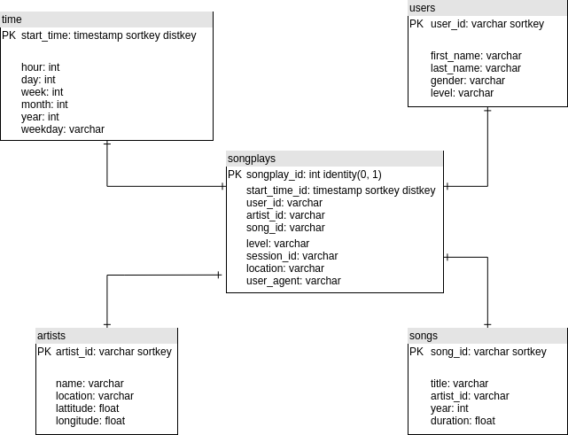

# Overview

Sparkify is a new startup company that released a new music streaming app. Their user base has increased and have outgrown their current architecture. They would like to move their operations to the cloud to take full advantage of their dataset and grow the company further.

In order to meet the companies needs, we will need to do the following:
* Design a data warehouse in Amazon Redshift. 
* Create an Amazon cluster through Python (Infrastructure as Code).
* Build a Python ETL pipeline to stage the data from S3 into Redshift.
* Perform the any necessary transformations and load the data into a set of dimensional data warehouse tables.
* Run the necessary queries against the data warehouse data.

## How to Run
1. Setup an [AWS account](https://aws.amazon.com/premiumsupport/knowledge-center/create-and-activate-aws-account/) and [create a user](https://docs.aws.amazon.com/IAM/latest/UserGuide/getting-started_create-admin-group.html) that has admin access.
2. Run **python3 venv_setup.py**
3. Update the dwh.cfg config file by updating your AWS **key and secret** with a user that has admin access to AWS.
4. Run **python3 etl.py** to create the cluster, populate data, and tear down.

## Project Structure
* aws_setup.py - Methods for handling AWS operations, used by etl.py.
* create_tables.py - Methods used to create/drop tables.
* dwh.cfg - Configuration file for the AWS configurations.
* etl.py - Main script to create cluster, populate the database, query the database, and tear down. 
* requirements.txt - Python libraries used in the virtual environment, used by venv_setup.py.
* Sparkify_Data_Warehouse.png - Data model
* sql_queries.py - Common sql queries used in etl operations.
* venv_setup.py - Script to create and configure a python virtual environment.

## Database Schema

## Results
Record counts for each table as a result of running etl.py.
* staging_events_table - 8056
* staging_songs_table - 14896
* songplays - 333
* users - 105
* songs - 14896
* artists - 10025
* timev8023

## Resources
* https://boto3.amazonaws.com/v1/documentation/api/latest/reference/services/redshift.html
* https://boto3.amazonaws.com/v1/documentation/api/latest/reference/services/redshift.html#Redshift.Client.describe_clusters
* https://docs.aws.amazon.com/redshift/latest/dg/r_COPY.html
* Udacity Data Engineering Nanodegree Program - Cloud Data Warehouses section.
* https://guides.github.com/features/mastering-markdown/
* https://stackoverflow.com/questions/7370801/measure-time-elapsed-in-python
* https://www.flydata.com/blog/amazon-redshift-distkey-and-sortkey/
* https://hackernoon.com/4-ways-to-manage-the-configuration-in-python-4623049e841b
* https://docs.aws.amazon.com/redshift/latest/dg/r_COPY.html

