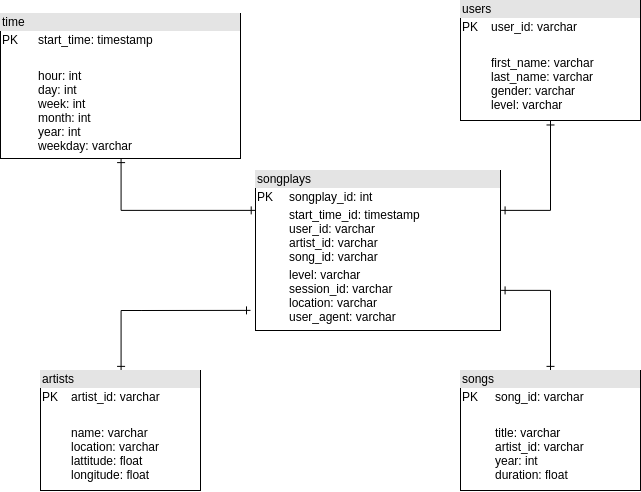

# Overview

Sparkify is a new startup company that released a new music streaming app. Their user base has increased and have outgrown their current architecture. They would like to move their data warehouse into a data lake in the cloud to take full advantage of their dataset and grow the company further.

In order to meet the companies needs, we will need to do the following:
* Design a data warehouse in S3.
* Build a Python ETL pipeline to extract data from S3, process the data in Spark, and upload the data into dimensional parquet tables in S3.
* Perform the any necessary transformations before uploading to S3.

## How to Run
1. Setup an [AWS account](https://aws.amazon.com/premiumsupport/knowledge-center/create-and-activate-aws-account/) and [create a user](https://docs.aws.amazon.com/IAM/latest/UserGuide/getting-started_create-admin-group.html) that has admin access to S3.
2. Run **python3 venv_setup.py**
3. Update the dl.cfg config file by updating your AWS **key and secret** with a user that has admin access to S3 in AWS.
4. Create an S3 bucket called: **dend-sparkify**
5. Run **python3 etl.py** to process the data.

## Project Structure
* dl.cfg - Configuration file for the AWS configurations.
* etl.py - Main script to process the data.
* requirements.txt - Python libraries used in the virtual environment, used by venv_setup.py.
* venv_setup.py - Script to create and configure a python virtual environment.

## Database Schema

## Resources
https://spark.apache.org/docs/2.2.0/sql-programming-guide.html#datasets-and-dataframes
https://stackoverflow.com/questions/35861099/overwriting-a-spark-output-using-pyspark
https://stackoverflow.com/questions/42951905/spark-dataframe-filter
https://spark.apache.org/docs/2.1.0/api/python/pyspark.sql.html
https://stackoverflow.com/questions/30949202/spark-dataframe-timestamptype-how-to-get-year-month-day-values-from-field
https://stackoverflow.com/questions/50174227/auto-incrementing-pyspark-dataframe-column-values
http://spark.apache.org/docs/latest/api/python/pyspark.sql.html#pyspark.sql.functions.monotonically_increasing_id
https://spark.apache.org/docs/2.1.0/api/python/pyspark.sql.html#pyspark.sql.SparkSession
https://spark.apache.org/docs/latest/configuration.html
https://stackoverflow.com/questions/43759896/spark-truncated-the-string-representation-of-a-plan-since-it-was-too-large-w
https://stackoverflow.com/questions/53583199/pyspark-error-unsupported-class-file-major-version-55
