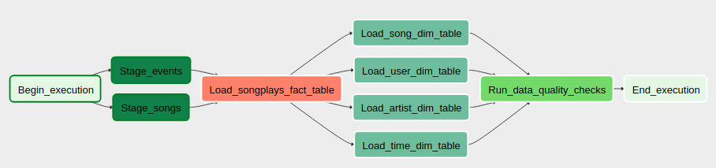

# Overview

Sparkify is a new startup company that released a new music streaming app. Their user base has increased and their architecture footprint is also increasing. To manage this infrastructure they are looking to increase the automation and monitoring of their data pipelines. They have chosen to use Apache Airflow as their tool of choice.

In order to meet the companies needs, we will need to do the following:
* Design a data warehouse in Amazon Redshift
* Build high grade data pipelines that are: dynamic, reusable, and include monitoring
* Include data quality checks on all data pipelines
* Stage data from S3 into Redshift staging tables
* Load data from Redshift staging tables into final fact/dimension tables

## How to Run
1. Setup an [AWS account](https://aws.amazon.com/premiumsupport/knowledge-center/create-and-activate-aws-account/) and [create a user](https://docs.aws.amazon.com/IAM/latest/UserGuide/getting-started_create-admin-group.html) that has read access to S3 and admin rights on Redshift.
2. Start up a Redshift cluster and grant your user (awsuser) access.

3. In the Redshift Query Editor run each create statement in the create_tables.sql file.

3. Run **python3 venv_setup.py**
4. Run **source venv/bin/activate**, you should see (venv) at the beginning of the line.
5. Run **pwd** and copy the path
6. Run **export AIRFLOW_HOME=(paste from step 5)/airflow**
7. Run **airflow initdb**
7. Open the ./airflow/airflow.cfg and set the following:
  * dags_folder = ./dags
  * plugins_folder = ./plugins
8. Create new terminal and run **source venv/bin/activate** then **airflow webserver -p 8080**
9. Create new terminal and run **source venv/bin/activate** then **airflow scheduler**
10. Navigate to http://localhost:8080/admin/variable/ and create a new one with the details:
  * Key = s3_bucket
  * Val = udacity-dend
11. Navigate to http://localhost:8080/admin/connection/ and create a new connection with the details:
  * Conn Id = aws_credentials
  * Conn Type = Amazon Web Services
  * Login = AWS Key from your IAM user credentials
  * Password = AWS Secret from your IAM user credentials
12. Navigate to http://localhost:8080/admin/connection/ and create a new connection with the details:
  * Conn Id = redshift
  * Conn Type = Postgres
  * Host = (enter your Redshift host path here without the port number)
  * Login = awsuser
  * Password = (awsuser password)
  * Port = 5439
13. Navigate to http://localhost:8080/admin/airflow/tree?dag_id=sparkify_dag and toggle the DAG to On in the upper left. Wait for the schedule to run or manually trigger.

## Project Structure
* dags/sparkify_dag.py - DAG that runs all the pipeline operations
* plugins/helpers/sql_queries.py - Insert sql statements used in the pipeline
* plugins/operators/data_quality.py - Runs the data quality checks against the Fact/Dimension tables.
* plugins/operators/load_dimension.py - Loads data from Redshift staging tables into the Dimension tables.
* plugins/operators/load_fact.py - Loads data from Redshift staging tables into the Fact table.
* plugins/operators/stage_redshift.py - Processes data from S3 to Redshift Staging tables.
* create_tables.sql - List of tables that need to be manually created.
* requirements.txt - Python libraries used in the virtual environment, used by venv_setup.py.
* venv_setup.py - Script to create and configure a python virtual environment.

## Database Schema

## Resources
* https://airflow.apache.org/tutorial.html
* https://airflow.apache.org/start.html
* https://github.com/puckel/docker-airflow/issues/395
* https://stackoverflow.com/questions/37048856/how-to-install-airflow
* https://stackoverflow.com/questions/9554087/setting-an-environment-variable-in-virtualenv
* https://virtualenvwrapper.readthedocs.io/en/latest/scripts.html#scripts
* https://www.applydatascience.com/airflow/airflow-variables/
* Udacity Data Engineering Nanodegree Classroom